 # INDICE

 #### [1.Introduzione](#introduzione)
 #### [2.Modello di Dominio](#modello-di-dominio)
#### [3.Requisiti specifici](#requisiti-specifici)
 + #### [3.1 Requisiti funzionali ](#31-requisiti-funzionali-1)
 + #### [3.2 Requisiti non funzionali ](#32-requisiti-non-funzionali-1)
#### [4.System Design](#4system-design-1)
+ #### [4.1 Stile Architetturale adottato](#41-stile-architetturale-adottato-1)
+ #### [4.2 Diagramma dei package](#42-diagramma-dei-package-1)
#### [5.OO Design](#5oo-design-1)
+ #### [5.1 Diagrammi delle classi](#51-diagrammi-delle-classi-1)
+ #### [5.2 Diagrammi di sequenza](#52-diagrammi-di-sequenza-1)
#### [6.Riepilogo del test](#6riepilogo-del-test-1)
#### [7. Manuale Utente](#7-manuale-utente-1)
#### [8.Processo di sviluppo e organizzazione del lavoro](#8processo-di-sviluppo-e-organizzazione-del-lavoro-1)
#### [9.Analisi Retrospettiva](#9analisi-retrospettiva-1)
+ #### [9.1 SPRINT 0](#91-sprint-0-1)
+ #### [9.2 SPRINT 1](#92-sprint-1-1)
## INTRODUZIONE
#### BATTLESHIP

#### **1**. _**Introduzione**_
_Single player_ 

Benvenuto nel gioco!

**BATTLESHIP** Single player, è una versione del classico gioco della Battaglia Navale che ti permetterà di giocare contro il tuo computer.

All’avvio di una partita, verranno posizionate casualmente le navi avversarie. Hai a disposizione due griglie: una conterrà la formazione delle tue navi, l’altra segnerà i colpi da te effettuati e il loro riscontro sulle navi avversarie. Puoi utilizzare quattro tipologie di navi (consulta la voce ‘_**help**_’).

Per vincere devi riuscire ad individuare le posizioni delle navi avversarie ed affondarle tutte. È concesso un numero massimo di tentativi, modificabile in base al livello di difficoltà che hai selezionato.

Buona fortuna!

#### [2.Modello di Dominio](#modello-di-dominio)
## MODELLO DI DOMINIO

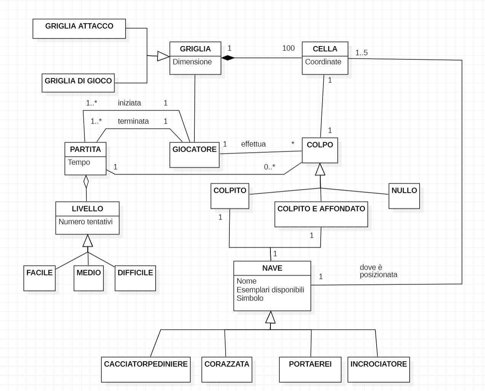

#### [3.Requisiti specifici](#requisiti-specifici)
## REQUISITI SPECIFICI
##### Di seguito sono riportati requisiti specifici implementati nel sistema, suddivisi in funzionali e non funzionali.

#### [3.1 Requisiti funzionali ](#31-requisiti-funzionali)
#### **3.1**. _**Requisiti funzionali**_

**-RF1:** il giocatore deve poter mostrare l’help con elenco dei comandi

_Criteri di accettazione:_

Al comando _**/help**_ o invocando l'app con flag _**--help** o **-h**_
Il risultato è una descrizione concisa, che normalmente appare all'avvio del programma, seguita dalla lista di comandi disponibili, uno per riga, come da esempio successivo:
+	gioca	
+	esci
+	...

**-RF2:** il giocatore deve poter chiudere il gioco

_Criteri di accettazione:_
Al comando _**/esci**_ l'applicazione chiede conferma 
+	se la conferma è positiva, l'applicazione si chiude restituendo il controllo al sistema operativo
+	se la conferma è negativa, l'applicazione si predispone a ricevere nuovi tentativi o comandi

**-RF3:** il giocatore deve poter scegliere il livello di gioco per variare il numero massimo di tentativi falliti

_Criteri di accettazione:_

Al comando  **_/facile_**
l’applicazione risponde con OK e imposta a 50 il numero massimo di tentativi falliti

Al comando **_/medio_** 
l’applicazione risponde con OK e imposta a 30 il numero massimo di tentativi falliti

Al comando **_/difficile_**
l’applicazione risponde con OK e imposta a 10 il numero massimo di tentativi falliti

**-RF4:** il giocatore deve poter mostrare il livello di gioco e il numero massimo di tentativi falliti

_Criteri di accettazione:_
Al comando **_/mostralivello_**
l’applicazione risponde visualizzando il livello di gioco e il numero di massimo di tentativi falliti

**-RF5:** il giocatore deve poter visualizzare i tipi di nave e il loro numero

_Criteri di accettazione:_
Al comando **_/mostranavi_**
l’applicazione risponde visualizzando, per ogni tipo di nave, la dimensione in quadrati e il numero di esemplari da affondare:
+ _Cacciatorpediniere 	⊠⊠ 		   esemplari: 4_
+	_Incrociatore 		⊠⊠⊠ 	  esemplari: 3_
+	_Corazzata 		    ⊠⊠⊠⊠ 	 esemplari: 2_ 
+	_Portaerei  		⊠⊠⊠⊠⊠ 	esemplari: 1_

**-RF6:** il giocatore deve poter iniziare una nuova partita

_Criteri di accettazione:_
Al comando **_/gioca_** 
se nessuna partita è in corso l'applicazione imposta causalmente le navi, in orizzontale o in verticale, mostra la griglia vuota e si predispone a ricevere il primo tentativo o altri comandi.

**-RF7:** il giocatore deve poter svelare la griglia con le navi posizionate

_Criteri di accettazione:_
Al comando **_/svelagriglia_**
l’applicazione risponde visualizzando, una griglia 10x10, con le righe numerate da 1 a 10 e le colonne numerate da A a J, e tutte le navi posizionate  

**-RF8:**  il  giocatore deve poter impostare direttamente il numero massimo di tentativi che si possono fallire

_Criteri di accettazione:_ 
Al comando **_/tentativi numero_** 
l’applicazione risponde con OK e imposta a numero il numero massimo di tentativi falliti

**-RF9:** il giocatore deve poter impostare la taglia della griglia

_Criteri di accettazione:_

Al comando **_/standard_** 
l’applicazione risponde con OK e imposta a 10x10 la dimensione della griglia (è il default).

Al comando **_/large_** 
l’applicazione risponde con OK e imposta a 18x18la dimensione della griglia.

Al comando **_/extralarge_** 
l’applicazione risponde con OK e imposta a 26x26la dimensione della griglia.

**-RF10:** il giocatore deve poter impostare il tempo di gioco

_Criteri di accettazione:_ 
Al comando **_/tempo numero_** 
l’applicazione risponde con OK e imposta a numero il numero minuti a disposizione per giocare.

**-RF11:** il giocatore deve poter mostrare il tempo di gioco

_Criteri di accettazione:_ 
Al comando **_/mostratempo_** 
l’applicazione risponde visualizzando il numero di minuti trascorsi nel gioco e il numero di minuti ancora disponibili.

**-RF12:** il giocatore deve poter effettuare un tentativo per colpire una nave

_Criteri di accettazione:_ 
Al comando **_/Attacca_**
Digitando una coppia di caratteri separati da un trattino, corrispondenti rispettivamente al numero di riga e alla lettera della colonna,(es. B-4), l’applicazione risponde 
+  “acqua” se sulla cella non è posizionata nessuna nave;
+  "colpito" se sulla cella è posizionata una nave;
+  "colpito e affondato" se sulla cella è posizionata una nave ed è l’ultima cella non colpita della nave.

Qualunque sia l’esito del tentativo, l’applicazione mostra la griglia con le navi colpite parzialmente o affondate, il numero di tentativi già effettuati, e il tempo trascorso. 

La partita termina con successo se il tentativo ha affondato l’ultima nave. 

La partita termina con insuccesso se è stato raggiunto il numero massimo di tentativi falliti o se è scaduto il tempo di gioco.

**-RF13:** il giocatore deve poter mostrare la griglia con le navi colpite e affondate

_Criteri di accettazione:_ 
Al comando **_/mostragriglia_** 
l’applicazione risponde visualizzando, una griglia con le righe numerate a partire da 1 e le colonne numerate a partire da A, con le navi affondate e le sole parti già colpite delle navi non affondate.

**-RF14:** il giocatore deve poter mostrare il numero di tentativi già effettuati e il numero di tentativi falliti

_Criteri di accettazione:_ 
Al comando **_/mostratentativi_** 
l’applicazione risponde visualizzando il numero di tentativi già effettuati il numero di tentativi falliti e il numero massimo di tentativi falliti.

**-RF15:** il giocatore deve poter abbandonare una partita

_Criteri di accettazione:_ 
Al comando **_/abbandona_** l'applicazione chiede conferma 

+  se la conferma è positiva, l’applicazione risponde visualizzando sulla griglia la posizione di tutte le navi e si predispone a ricevere nuovi comandi

+  se la conferma è negativa, l'applicazione si predispone a ricevere nuovi tentativi o comandi

**-RF16:** il giocatore deve poter impostare il numero massimo di tentativi falliti per livello di gioco

_Criteri di accettazione:_
+ Al comando **_/facile numero**_
l'applicazione risponde con OK e imposta a _numero_ il numero di tentativi falliti

+ Al comando **_/medio numero**_
l'applicazione risponde con OK e imposta a _numero_ il numero di tentativi falliti

+ Al comando **_/difficile numero**_
l'applicazione risponde con OK e imposta a _numero_ il numero di tentativi falliti

#### [3.2 Requisiti non funzionali ](#32-requisiti-non-funzionali)
+ ##### **3.2 Requisiti non funzionali**
+ **RNF1:** il container docker dell’app deve essere eseguito da terminali che supportano Unicode con encoding UTF-8 o UTF-16

**Elenco di terminali supportati**
Linux:
 + terminal
  
Windows:
	
+ Powershell
+ Git Bash (in questo caso il comando Docker ha come prefisso winpty; es: winpty docker -it ....)
  
**Comando per l’esecuzione del container**
Dopo aver eseguito il comando docker pull copiandolo da GitHub Packages, Il comando Docker da usare per eseguire il container contenente l’applicazione è:
docker run --rm -it ghcr.io/softeng2223-inf-uniba/battleship-Cocke:latest

#### [4.System Design](#system-design)
## SYSTEM DESIGN

##### **4.System Design**

+ ##### **4.1 Stile Architetturale adottato**

+ #### [4.1 Stile Architetturale adottato](#stile-architetturale-adottato)

L'applicazione *"BattleShip"* fonda il suo funzionamento sull'interazione con l'utente.

Il pattern architetturale adottato è l'*ECB*
(Entity-Control-Boundary)  un'organizzazione logica dei componenti di un sistema software improntata sulla scissione dei concetti di entità, controllo e confine.

Nel *pattern ECB*, un'applicazione viene suddivisa in tre sezioni:

+ **Entity (Entità)**: questa componente rappresenta il nucleo dell'applicazione e ne contiene la logica di business e i dati. 
Le entità rappresentano gli oggetti concettuali del dominio dell'applicazione, come utenti, prodotti, ordini, ecc. Queste entità contengono sia i dati che le operazioni relative ad essi.

+ **Control (Controllo)**: Il componente di controllo funge da intermediario tra le entità e i confini dell'applicazione.
 È volto alle gestione del flusso di controllo dell'applicazione, nonché alla coordinazione delle interazioni tra le entità e i confini. Il controllo implementa la logica dell'applicazione, effettuando calcoli, applicando regole di business e coordinando il recupero e la persistenza dei dati.

+ **Boundary (Confine)**: Questo componente gestisce le interazioni dell'applicazione con gli attori esterni, come l'interfaccia utente, i servizi web o altri sistemi. I confini forniscono un'interfaccia per l'input e l'output dell'applicazione. Ad esempio, un'interfaccia utente grafica o una serie di API sono esempi di confini.

L'*ECB* è un pattern architetturale utilizzato comunemente nello sviluppo software, specialmente nelle applicazioni orientate agli oggetti.

Per tali motivi, il gruppo "Cocke" ha deciso di assegnare al progetto uno stile architetturale ECB.

+ #### [4.2 Diagramma dei package](#diagramma-dei-package)

+ ##### **4.2 Diagramma dei package**

Il progetto è stato strutturato in 4 package come di seguito riportato:

+ il package **colours** contiene la classe **"Colours"** utilizza per l'applicazione dei colori nell'interfaccia 

+ il package **grid** contiene la classe **"GameGrid"** realizzata per  l'implementazione delle griglie di gioco 

+ il package **ship** contiene le classi **"Ship"** e **"Coordinates"** utili alla creazione delle navi e all'inserimento delle coordinate

+ il package **game** contiene le classi **"Generics"** e **"PlayGame"** indispensabili ai fini della partita poiché costituite dai metodi che realizzano gli attacchi con i relativi esiti.

Segue il **diagramma dei package** :

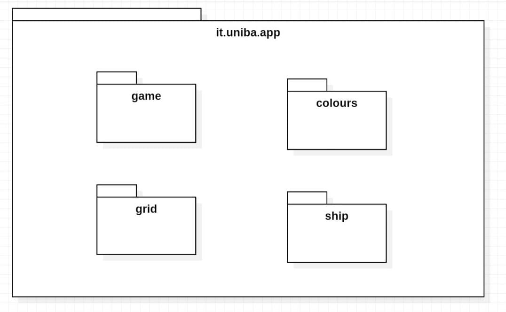

#### [5.OO Design](#oo-design)
## OO DESIGN
A seguire sono riportati i diagrammi di classe e di sequenza relativi alle _user-story_ fondamentali. 

I diagrammi presentano un **livello di dettaglio** _medio-basso_: abbiamo scelto di non riportare nelle varie rappresentazioni, dettagli come i ritorni dei metodi, le inizializzazioni degli attributi, i parametri dei metodi, la cui segnatura ne prevede di numerosi. 

In buona sostanza quindi la predilezione di alcuni contenuti piuttosto che altri, è scaturita dal non voler sovraccaricare l’interfaccia, in modo da garantire maggiore decifrabilità e agilità nella comprensione del prodotto all’utente. 

A tal proposito ci teniamo a precisare che i metodi, mancano dei loro parametri che non sono per tal ragione necessariamente metodi cui non arriva nulla in input. 

Abbiamo d’altra parte optato per l’inserimento di tutti gli attributi di ogni classe così da fornire una quadro più completo e generale dell’organizzazione del progetto. 

Di tutte le classi componenti il progetto, solo la classe “GameGrid” presenta l’inizializzazione degli attributi in quanto corrisponde ai simboli che effettivamente l’utente vedrà a video durante il gioco.

Per quanto concerne la clausola “final”, è stata esplicitata nei vari diagrammi solo per gli attributi per le stesse motivazioni sopracitate, nonché per garantire una visibilità più compatta e leggibile.

+ #### [5.1 Diagrammi delle classi](#diagrammi-delle-classi)

+ ##### **5.1 Diagrammi delle classi**

Di seguito è presentato il modello a prospettiva software generale del progetto.

#####    *Diagramma delle classi Generale*
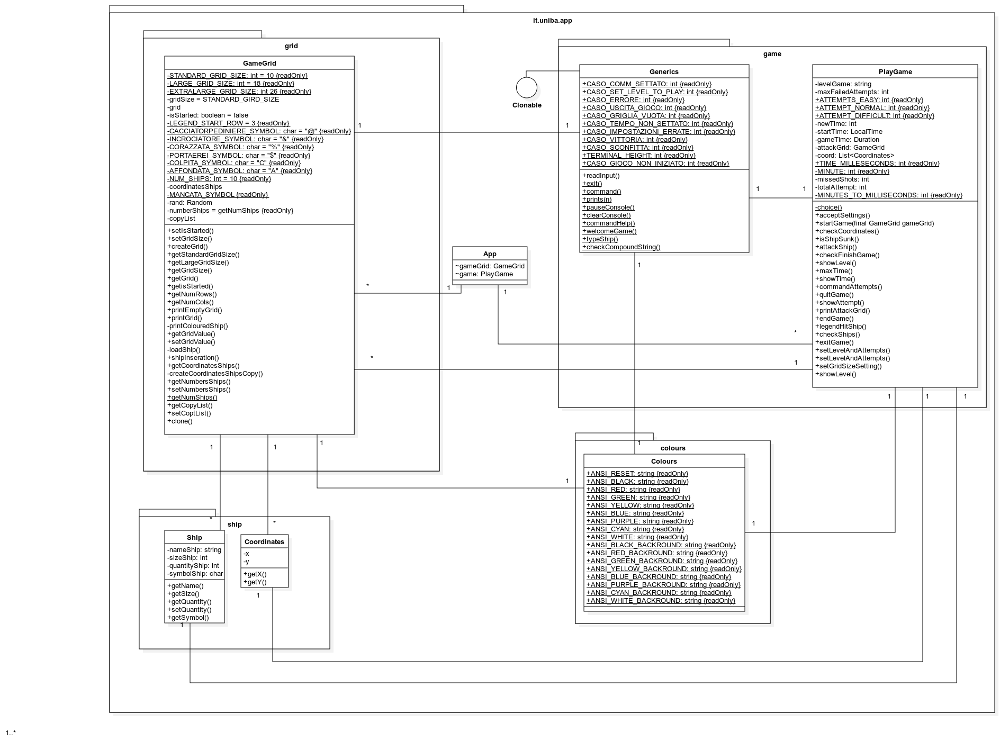

Di seguito sono presentati i modelli a prospettiva software delle user story:

#####    *Diagramma delle classi Help*
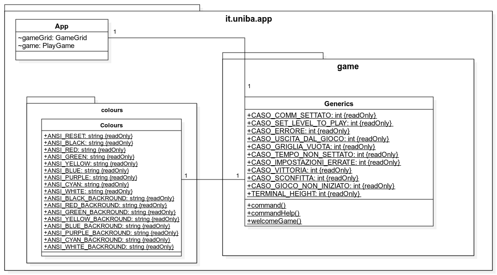

#####    *Diagramma delle classi Gioca*
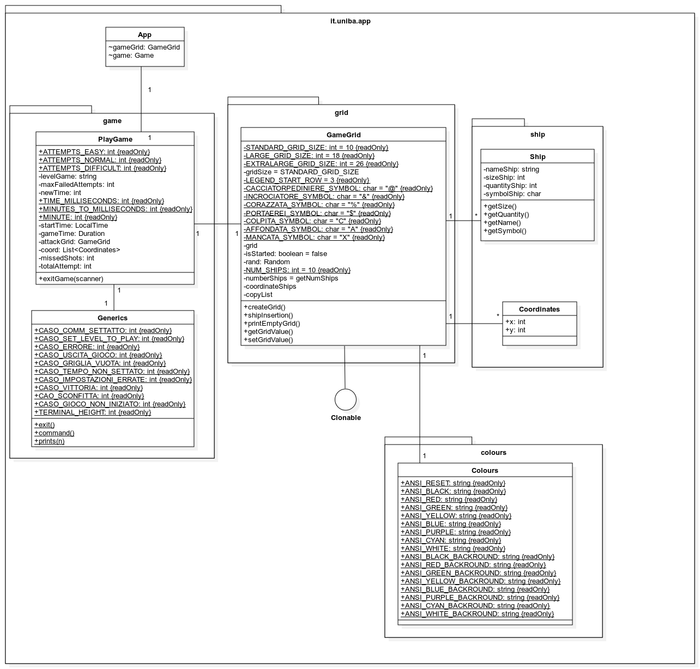

#####    *Diagramma delle classi Attacca*
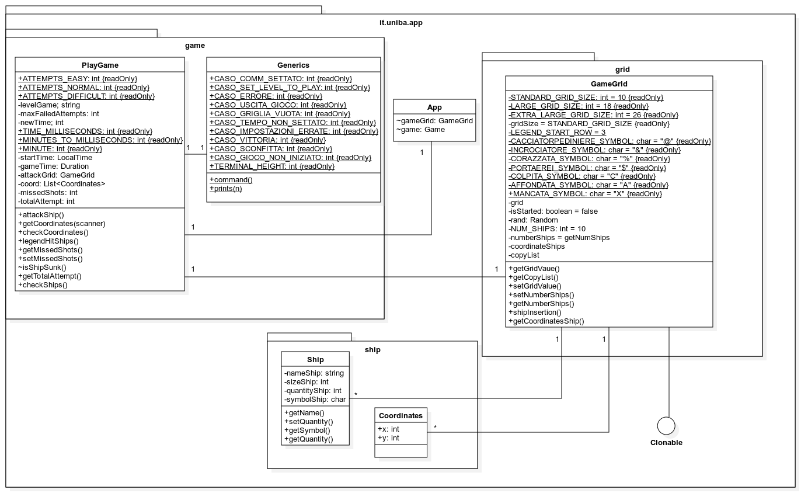

#####   *Diagramma delle classi Esci*
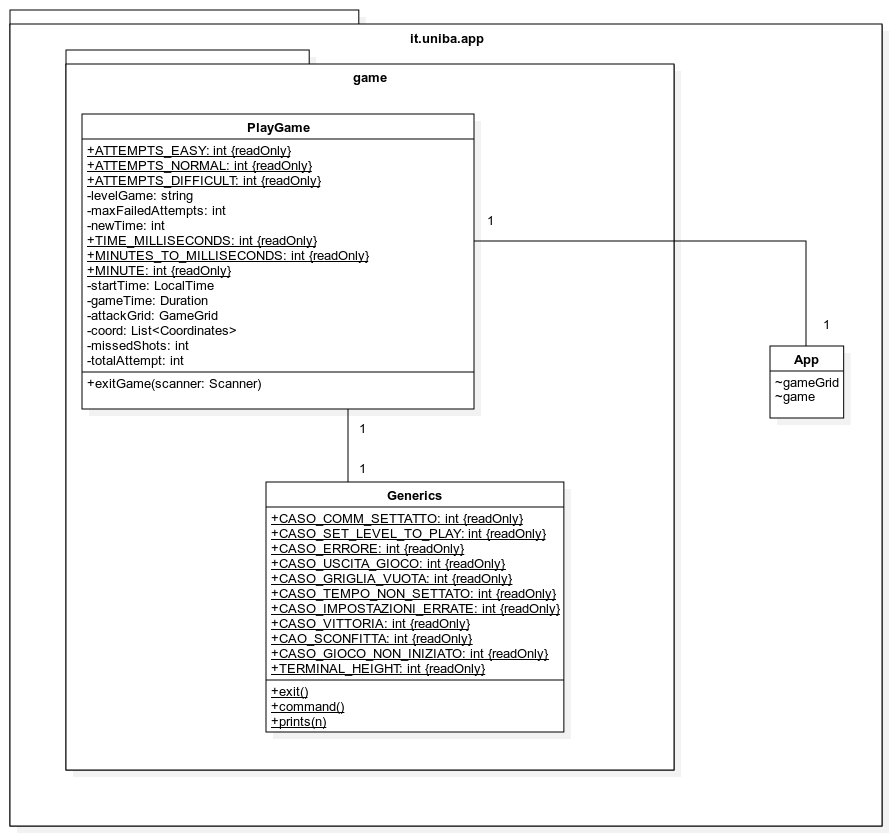

#####    *Diagramma delle classi Abbandona*
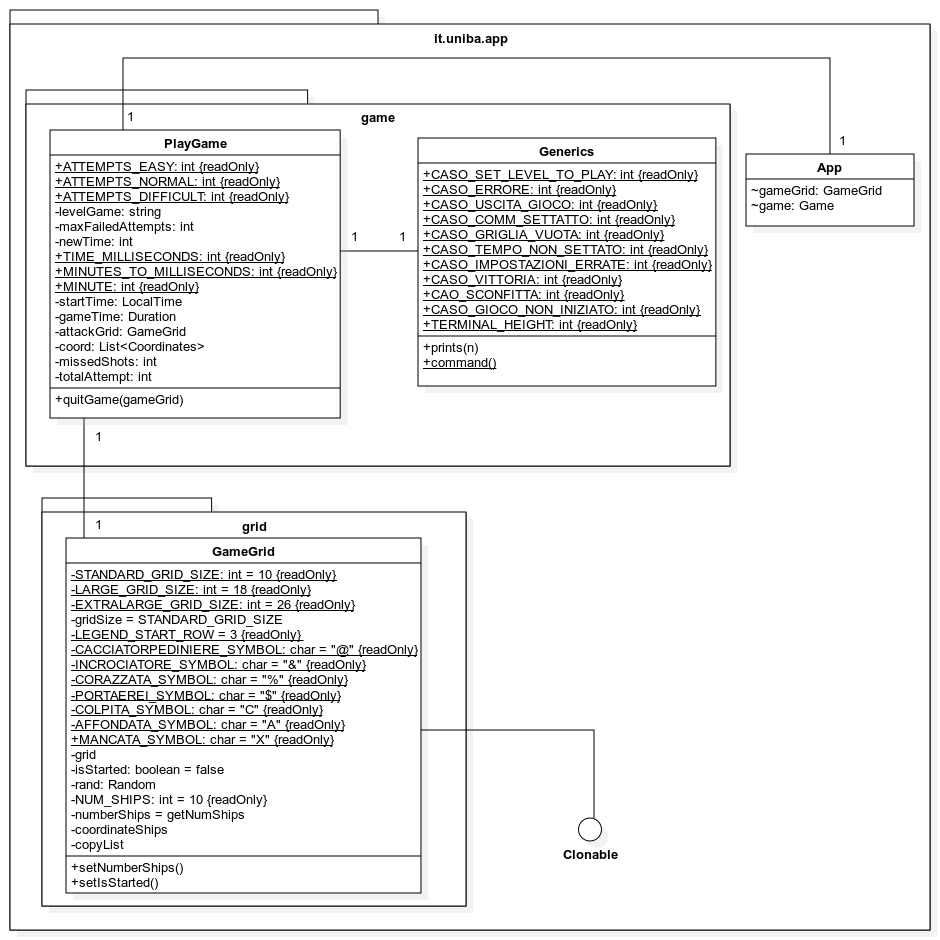

+ #### [5.2 Diagrammi di sequenza](#diagrammi-di-sequenza)

+ ##### **5.2 Diagrammi di sequenza**

Di seguito sono presentati i diagrammi di sequenza delle user story:

#####    *Diagramma di sequenza Help*

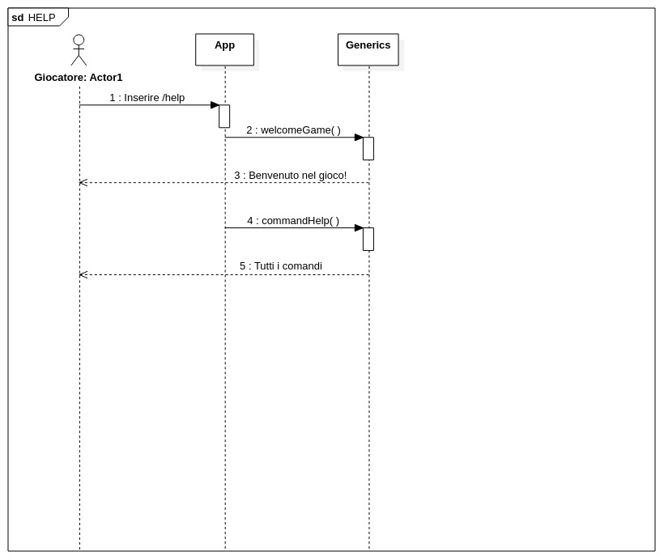

#####    *Diagramma delle classi Gioca*
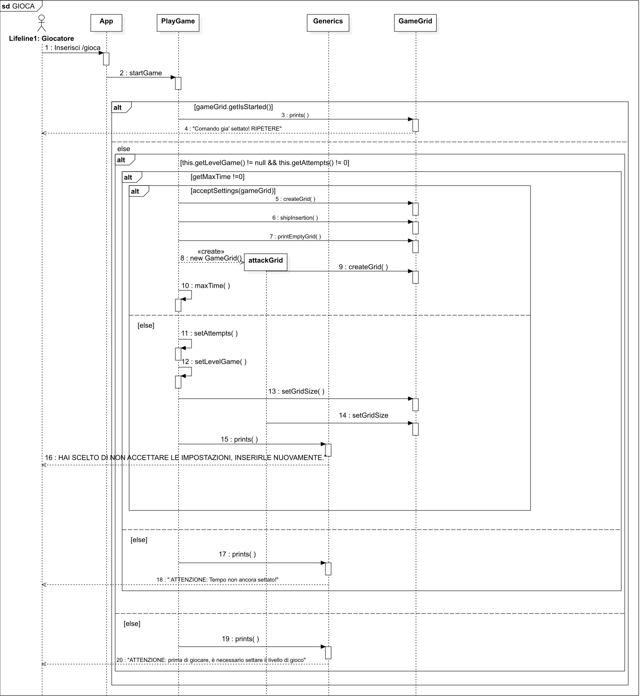

#####    *Diagramma delle classi Attacca*
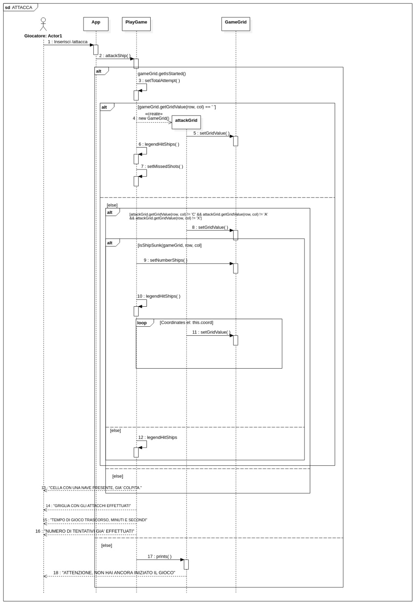

#####    *Diagramma delle classi Esci*
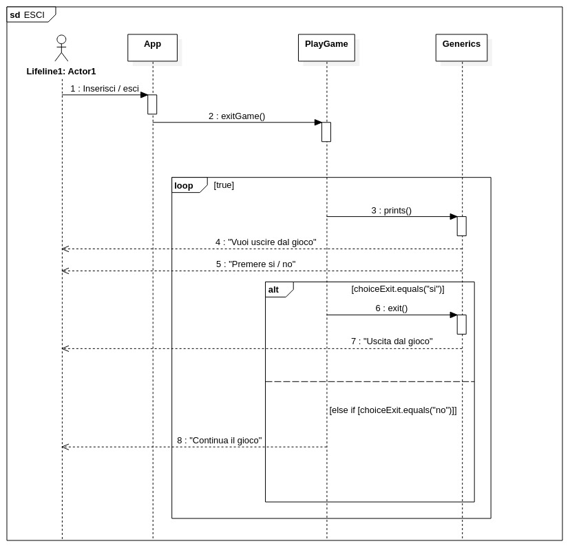

#####    *Diagramma delle classi Abbandona*
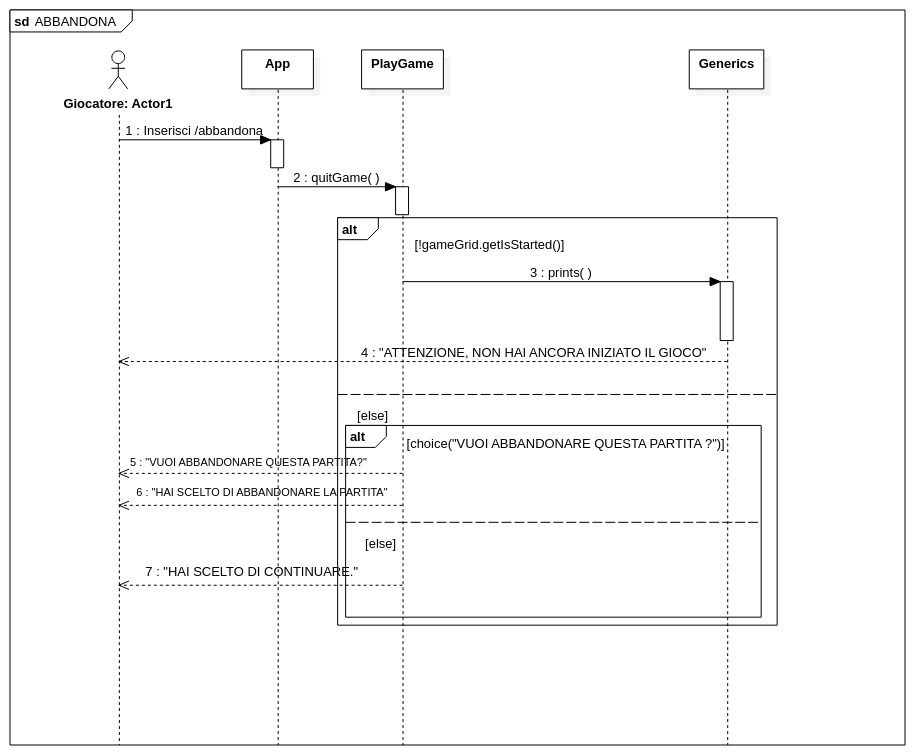

#### [6.Riepilogo del test](#riepilogo-del-test)
## RIEPILOGO CASI DI TEST
Al fine di identificare eventuali bug o errori di implementazione e assicurare che le classi del progetto funzionino come previsto, sono stati creati per ogni classe dei casi di test. 

Creati per coprire diversi scenari e garantire che i metodi delle classi Generics e PlayGame, si comportino correttamente in ognuno di essi, ecco qui riportati alcuni dei casi di test che sono stati utilizzati:

**_(casi di Test per la classe Generics)_**
+ **_setupReadInput_**
  + è stato creato per isolare e preparare correttamente lo scanner con un input specifico prima di ogni test, garantendo la riproducibilità e coprendo uno scenario comune di acquisizione di input.
 
+ **_testCheckCompoundStringWithValidInput_**
  + il caso di test è stato creato per verificare che il metodo **_checkCompoundString_** funzioni correttamente con un input valido e garantisce che l'applicazione possa gestire correttamente questo tipo di input comune.
  
+ **_testCheckCompoundStringWithInvalidInput_**
  + è stato creato per garantire che la classe Generics funzioni correttamente nel riconoscimento di input non 
  valido e fornisca il risultato atteso in tali situazioni

+ **_testCheckCompoundStringWithInsufficientInput_**
  + Il caso di test è stato creato per verificare il comportamento del metodo **_checkCompoundString_** della classe Generics quando viene fornito un input insufficiente. Il test garantisce che il metodo gestisca correttamente questa situazione e restituisca il valore corretto. Nel contesto dell'applicazione o del modulo in cui viene utilizzato il metodo **_checkCompoundString_**, potrebbe essere fondamentale che l'input contenga entrambe le parti richieste (una stringa seguita da un numero intero), e che il metodo segnali un input insufficiente come non valido. Effettuando il test con un input che contiene solo la prima parte, nel caso specifico l'array {_"hello"_}, ci si aspetta che il metodo **_checkCompoundString_** restituisca _false_, indicando che l'input non è valido perché manca la seconda parte. In questo modo, è possibile verificare se il metodo si comporta come previsto e adempie al suo scopo di rilevare input incompleti o insufficienti.

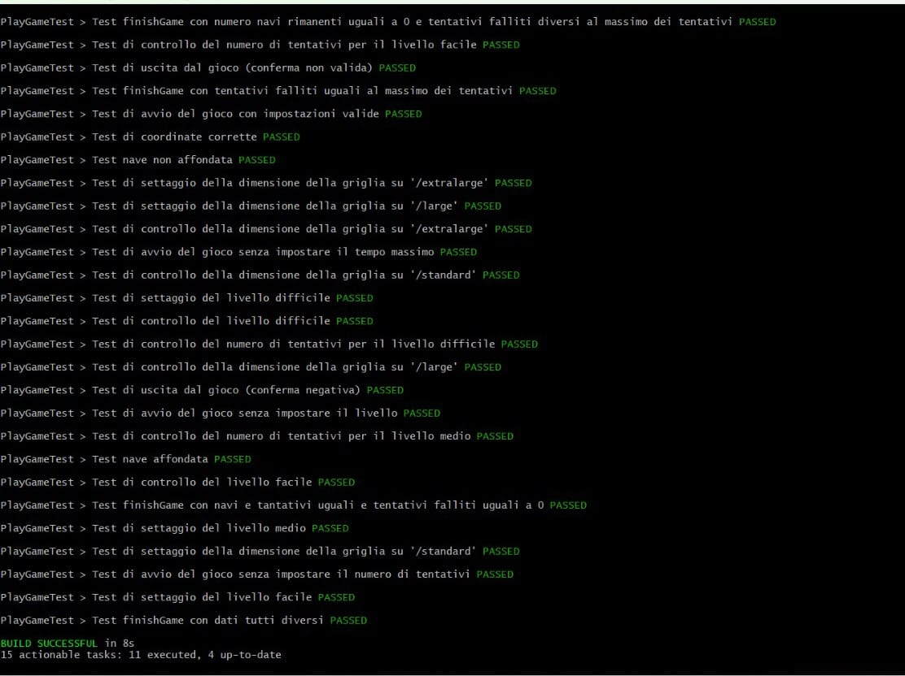
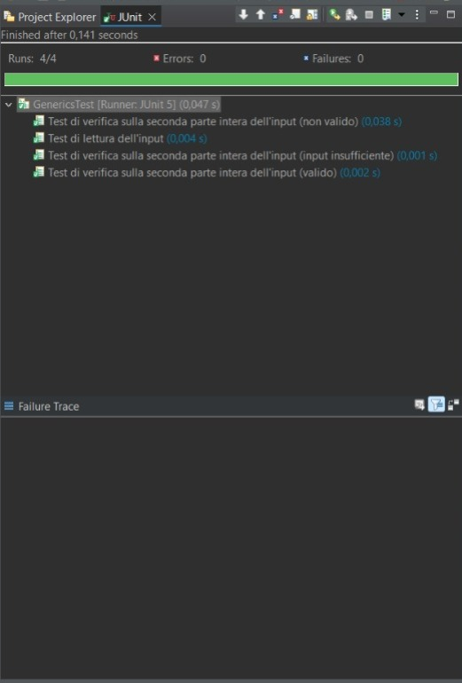

**_(casi di Test per la classe PlayGame)_**
+ **_ testExitGameReturnsTrueWhenChoiceExitIsNo_**
  + è stato effettuato per verificare il corretto funzionamento della funzione **_exitGame_** nel gioco. E' stato simulato un input utente in cui viene inserita la scelta _'no'_ per confermare la volontà di uscire dal gioco. L'obiettivo di questo caso di test è assicurarmi che la funzione ritorni il valore booleano _'true'_ corrispondente all'uscita dal gioco quando la scelta dell'utente è negativa. In questo modo, posso verificare che la logica di gestione dell'uscita dal gioco sia implementata correttamente e che la funzione fornisca il risultato atteso.
  
+ **_testExitGameReturnsTrueWhenChoiceExitIsInvalid_**	
  + nel gioco è stata implementata una funzionalità che consente al giocatore di uscire dal gioco in qualsiasi momento. Per garantire che questa funzionalità funzioni correttamente, è stato necessario creare un caso di test che verifichi il comportamento del metodo **_exitGame()_** nel caso in cui il giocatore inserisca una conferma non valida per l'uscita dal gioco. Questo caso di test aiuta a garantire che il metodo **_exitGame()_** gestisca correttamente le conferme non valide per l'uscita dal gioco e che il comportamento sia conforme alle specifiche del gioco.
  
+ **_testSetLevelAndAttemptsEasy()_**
  + Il caso di test  è stato creato per verificare la corretta funzionalità del metodo **_setLevelAndAttempts()_**.
  La motivazione principale per questo caso di test è assicurarsi che il metodo sia in grado di accettare correttamente l'input del livello di difficoltà e dei tentativi e di impostarli adeguatamente all'interno dell'oggetto "game". 
  La motivazione per la verifica dell'output "assertTrue" è che ci si aspetta che il metodo restituisca _"true"_ se l'impostazione del livello di difficoltà avviene correttamente, indicando che il test è superato con successo. Al contrario, se il metodo restituisce _"false"_, il test fallirebbe, indicando un problema nella funzionalità del metodo.
  In definitiva, il caso di test mira a garantire che il metodo **_setLevelAndAttempts()_** funzioni correttamente nell'impostare correttamente il livello di difficoltà e i tentativi all'interno dell'oggetto "game" quando viene fornito un input valido come _"/facile"._

+ **_testAttemptsForNormalLevel()_** 
  +  Il caso di test è stato creato per verificare la corretta gestione del numero di tentativi per il livello medio nel gioco.
  Il test è stato creato quindi per garantire che il numero di tentativi per il livello medio nel gioco sia gestito correttamente, assicurando così un'esperienza di gio-co equilibrata e soddisfacente per i giocatori che scelgono questo livello di difficoltà.

+ **_testAttemptsForNormalLevel()_**
  + è stato creato per garantire che il numero di tentativi per il livello medio nel gioco sia gestito correttamente, assicurando così un'esperienza di gioco equilibrata e soddisfacente per i giocatori che scelgono questo livello di difficoltà.

+ **_testSetLevelAndAttemptsDifficult()_**
	+ L'obiettivo di questo caso di test è verificare la corretta funzionalità del metodo **_setLevelAndAttempts_** nella classe 'PlayGame'. In particolare, si vuole verificare se è possibile impostare il livello di difficoltà del gioco su _'difficile'_ e se il metodo restituisce il valore corretto di conferma. In conclusione, questo caso di test è stato implementato per garantire che il sistema di gioco sia in grado di gestire correttamente l'impostazione del livello di difficoltà su _'difficile'_, fornendo una conferma di successo attraverso il valore di ritorno del metodo **_setLevelAndAttempts_**.
  
+ **_testLevelGameIsDifficult()_**
	+ Il motivo per cui è stato utilizzato questo caso di test è per verificare che il metodo **_setLevelAndAttempts()_** della classe PlayGame funzioni correttamente quando viene impostato il livello di gioco su "_difficile_". L'obiettivo è assicurarsi che, dopo l'impostazione del livello su "_/difficile_", il valore restituito dal metodo **_getLevelGame()_** sia effettivamente "_difficile_". Utilizzando questo caso di test, posso controllare se la classe PlayGame gestisce correttamente l'impostazione del livello e se il valore viene assegnato correttamente alla variabile levelGame. In caso di fallimento dell'assertion, verrà lanciata un'eccezione con un messaggio che indica che il livello impostato è errato.
  
+ **_testAttemptsForDifficultLevel()_**
	+ il caso di test in questione mira a garantire che il gioco rispetti le aspettative del numero di tentativi per il livello difficile, garantendo una corretta esperienza di gioco e soddisfacendo i requisiti del progetto.
  
+ **_testSetGridSizeSettingStandard()_**
  + Il motivo per cui è stato utilizzato questo caso di test è per verificare se il metodo **_setGridSizeSetting()_** è in grado di impostare correttamente la dimensione della griglia quando viene fornito il parametro "_/standard_".
  L'obiettivo del test è assicurarsi che il metodo funzioni correttamente e restituisca un valore booleano true per indicare che la dimensione della griglia è stata impostata correttamente su "_/standard_".
  Attraverso questo caso di test, si mira a garantire che il metodo **_setGridSizeSetting()_** sia in grado di interpretare correttamente il parametro "_/standard_" e impostare la dimensione della griglia di gioco di conseguenza.
  In questo modo, il caso di test contribuisce ad assicurare che il sistema sia correttamente configurato per gestire una dimensione della griglia standard, fornendo una base solida per ulteriori funzionalità e test successivi.

+ **_testCheckGridSizeStandard()_**
	+ In particolare, il test controlla se la dimensione della    griglia impostata dalla funzione **_setGridSizeSetting()_** corrisponde alla dimensione standard predefinita. Se la dimensione della griglia non corrisponde alla dimensione standard, il test fallisce e viene restituito un messaggio di errore.
  Questo caso di test è importante per garantire che il gioco funzioni correttamente quando viene impostata la dimensione della griglia standard.

+ **_testSetGridSizeSettingLarge()_**
	+ Il motivo per cui è stato utilizzato questi casi di test  è verificare il corretto settaggio della dimensione della griglia quando l'opzione _'/large'_ viene selezionata, assicurandomi che il settaggio della dimensione della griglia funzioni correttamente per la dimensione _'/large'_.

+ **_testCheckGridSizeLarge()_**
	+ La dimensione della griglia è un aspetto fondamentale del    nostro gioco e desideriamo assicurarci che la funzionalità responsabile di impostare la dimensione della griglia su _'/large'_ funzioni correttamente. Abbiamo implementato questo caso di test per verificare che, quando viene impostata la dimensione della griglia su _'/large'_, il valore effettivo della dimensione della griglia corrisponda al valore previsto per la dimensione _'large'_. In questo modo, possiamo garantire che i giocatori ricevano la griglia corretta quando selezionano l'opzione _'large'_ e che il gioco si comporti come previsto.
  
+ **_testSetGridSizeSettingExtraLarge()_**
	+ Ho utilizzato questo caso di test per verificare la      corretta gestione della dimensione della griglia nel contesto specifico dell'opzione "/extralarge". Questo è importante perché la dimensione della griglia influisce direttamente sull'esperienza di gioco e sull'interazione dell'utente con il sistema. Questa verifica è cruciale per garantire che il sistema stia utilizzando correttamente la dimensione richiesta, in modo che i giocatori possano godere di un'esperienza di gioco adeguata e che i comportamenti del sistema siano conformi alle aspettative degli utenti.

+ **_testCheckGridSizeExtraLarge()_**
	+ Si è utilizzato il caso di test ' per verificare che la   funzione **_playGame.setGridSizeSetting()_** si comporti correttamente quando viene impostata la dimensione della griglia su '_/extralarge_'. Questo caso di test è importante perché la dimensione della griglia influisce direttamente sul gameplay del gioco, e assicurarsi che la dimensione corrisponda effettivamente a quella prevista è fondamentale per garantire un'esperienza di gioco corretta e coerente. In caso di fallimento di questa asserzione, il test segnalerà che la dimensione della griglia non corrisponde alla dimensione extralarge desiderata, consentendo di individuare e correggere eventuali errori nella funzione di impostazione della dimensione della griglia.
   
+ **_testStartGameWithValidSettings()_**
	+ Nel caso di test è stato verificando il corretto avvio  del gioco con impostazioni valide. Questo caso di test è importante per garantire che il gioco venga avviato correttamente e che le impostazioni iniziali siano gestite adeguatamente. Questo caso di test è fondamentale per garantire che il gioco funzioni correttamente e che le impostazioni iniziali siano gestite correttamente. Assicurarsi che il gioco venga avviato correttamente è un passo importante per garantire un'esperienza utente positiva e per identificare eventuali problemi o errori nelle impostazioni iniziali del gioco.
 
+ **_testStartGameWithoutSettingLevel()_**
	+ Il motivo per cui hai utilizzato questo caso di test è quello di verificare il comportamento del sistema quando si tenta di avviare il gioco senza impostare il livello. È importante testare questo scenario perché il sistema dovrebbe gestire correttamente questa situazione e non avviare il gioco se il livello non è stato impostato correttamente. La motivazione per questo caso di test è quella di garantire che il sistema sia in grado di riconoscere quando il livello non è impostato correttamente e di evitare l'avvio del gioco in tali situazioni. Verificare questa condizione può aiutare a identificare eventuali bug o comportamenti indesiderati nel sistema e ad assicurarsi che venga fornita una corretta esperienza di gioco agli utenti.
  
+ **_testStartGameWithoutSettingAttempts()_**
	+ La presenza di questo caso di test consente di individuare eventuali difetti nel sistema che potrebbero consentire l'avvio del gioco senza il numero di tentativi impostato correttamente. Inoltre, assicura che il sistema gestisca correttamente questa situazione e impedisca l'avvio del gioco fino a quando il numero di tentativi non viene impostato correttamente.
  In sintesi, questo caso di test aiuta a garantire che il sistema si comporti correttamente quando il numero di tentativi non è stato impostato e che venga fornito un feedback appropriato agli utenti per risolvere il problema prima di avviare effettivamente il gioco.

+ **_testStartGameWithoutSettingMaxTime()_**
	+ Il motivo per cui ho utilizzato questo caso di test è per  verificare il comportamento del sistema quando il tempo massimo del gioco non viene impostato correttamente. Questo caso di test mira a testare la funzionalità di avvio del gioco in una situazione in cui il tempo massimo non è stato specificato. La motivazione dietro la scelta di questo caso di test è che il tempo massimo è un elemento fondamentale per il corretto funzionamento del gioco. Se il tempo massimo non viene impostato correttamente, il gioco potrebbe avviarsi in modo imprevisto o potrebbe non funzionare come previsto. Pertanto, è importante assicurarsi che il sistema gestisca correttamente questa situazione, impedendo l'avvio del gioco se il tempo massimo non è stato impostato. Utilizzando questo caso di test, posso verificare se il sistema riconosce correttamente l'assenza di un tempo massimo impostato e impedisce l'avvio del gioco. L'asserzione "_assertFalse_" nel caso di test controlla se il gioco è stato avviato nonostante il tempo massimo non sia stato impostato, assicurando così che il sistema si comporti come previsto. In definitiva, l'obiettivo di questo caso di test è garantire che il sistema gestisca correttamente la situazione in cui il tempo massimo non è impostato, prevenendo l'avvio del gioco e mantenendo il corretto funzionamento dell'applicazione.

+ **_testStartGameWithWrongSettings()_**
	+ Il motivo per cui ho utilizzato questo caso di test è per verificare il corretto comportamento del sistema nel momento in cui vengono fornite impostazioni errate durante l'avvio del gioco. È importante testare questa situazione perché il sistema dovrebbe essere in grado di rilevare e gestire gli errori nelle impostazioni, evitando di avviare il gioco con configurazioni non valide. In questo modo, sto testando se il sistema gestisce correttamente le impostazioni errate, evitando l'avvio del gioco e mantenendo lo stato isStarted a false. Questo caso di test è importante per garantire la corretta funzionalità del sistema in situazioni di configurazione non valide.
  
+ **_testGetCoordinatesWithValidInput()_**
	+ Il caso di test "testGetCoordinatesWithValidInput" è stato creato per verificare la corretta funzionalità del metodo "getCoordinates" della classe "PlayGame" quando viene fornito un input valido. In questo caso specifico, l'input fornito è **"B-4"**, che rappresenta una coordinata valida all'interno del gioco. La ragione per cui è stato scelto questo caso di test è che rappresenta una situazione tipica in cui un giocatore inserisce una coordinata valida durante una partita. Il test verifica se il metodo **_getCoordinates_** riesce a elaborare correttamente l'input fornito e restituire le coordinate corrispondenti. il caso di test è stato progettato per verificare che il metodo **_getCoordinates_** funzioni correttamente quando viene fornito un input valido, consentendo così di identificare e risolvere eventuali problemi o errori nel codice.

+ **_testCheckFinishGameMissedShotsEqualToAttemptsReturnsTrue() _**
  + Lo scopo di questo caso di test è verificare il     comportamento del metodo _checkFinishGame_ quando il numero di tentativi falliti è uguale al massimo dei tentativi consentiti. Questo caso è importante perché ci assicura che il gioco sia considerato concluso correttamente quando il giocatore ha esaurito tutti i suoi tentativi senza colpire alcuna nave. Utilizzando questo caso di test, possiamo verificare se il metodo _checkFinishGame_ gestisce correttamente la condizione in cui il numero di tentativi falliti è uguale al massimo dei tentativi consentiti, garantendo così che il gioco venga considerato correttamente concluso.

+ **_testCheckFinishGameNumberShipsEqualToZeroReturnsTrue()_**
  + Questo caso rappresenta una situazione in cui tutte le navi sono state distrutte, ma il giocatore ha ancora la possibilità di effettuare ulteriori tentativi. L'obiettivo è assicurarsi che la funzione restituisca correttamente il valore booleano true, indicando che il gioco è terminato con successo nonostante le navi siano state eliminate, ma il giocatore abbia ancora tentativi disponibili.

+ **_testCheckFinishGameMissedShotsLessThanAttemptsReturnsFalse()_**
  + Il caso di test è stato creato per verificare il comportamento del metodo **_"checkFinishGame"_** quando il numero di navi rimanenti nel gioco è uguale a zero. In questa situazione, ci si aspetta che il metodo restituisca il valore booleano true, indicando che il gioco è terminato. In conclusione, questo caso di test è stato progettato per verificare che il metodo **_"checkFinishGame"_** funzioni correttamente quando il numero di navi rimanenti nel gioco è zero e che restituisca il valore booleano atteso.

+ **_testShowAttemptGameStarted()_**
  + Al fine di verificare la corretta visualizzazione delle informazioni relative al numero massimo di tentativi falliti, al numero di tentativi effettuati e al numero di tentativi falliti durante il gioco. questo caso di test serve per assicurarsi che la visualizzazione delle informazioni relative ai tentativi sia corretta quando il gioco è iniziato, contribuendo a garantire l'affidabilità del sistema e l'adeguato funzionamento dell'interfaccia utente.

+ **_testShowAttemptGameNotStarted()_**
  + Al fine di Verificare che il metodo **_"showAttempt"_** del gioco restituisca correttamente un messaggio di avviso quando il gioco non è ancora iniziato.  È importante testare questa condizione perché vogliamo assicurarci che il gioco gestisca correttamente il caso in cui un giocatore tenta di visualizzare un tentativo prima che il gioco sia stato avviato. L'obiettivo è assicurarsi che il messaggio di avviso venga visualizzato correttamente per informare il giocatore che il gioco non è ancora iniziato e che non può visualizzare alcun tentativo. La motivazione dietro l'utilizzo di questo caso di test è quindi quella di verificare che il gioco gestisca correttamente il caso in cui il giocatore tenti di visualizzare un tentativo prima che il gioco sia iniziato, assicurandoci che venga mostrato il messaggio appropriato.
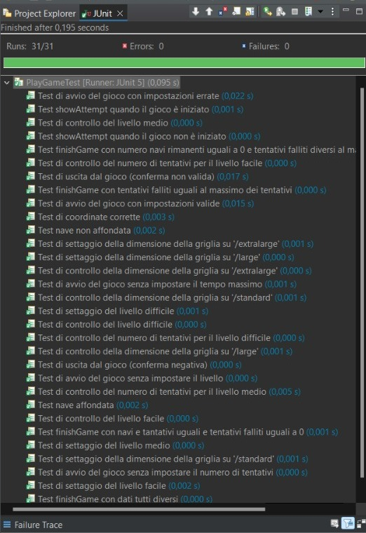
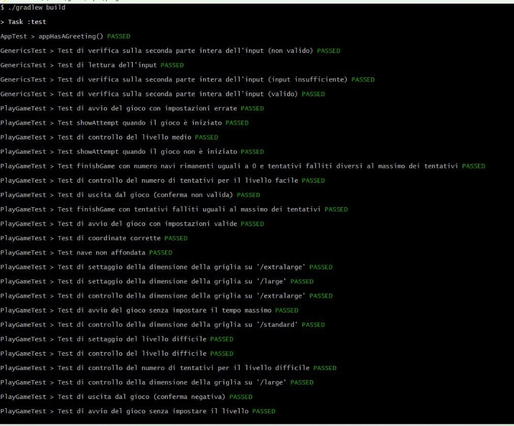

Non sono stati effettuati casi di test sulle classi "Coordinates", "Ship", "GameGrid" e "Colours" in quanto abbiamo ritenuto opportuno svolgerli per le classi più complesse ed eventualmente più soggette a bug.
Questo non è il caso di classi come "PlayGame", che coordinano il flusso del programma e la comunicazione tra diverse enità. 

#### [7. Manuale Utente](#manuale-utente)
## MANUALE UTENTE 
Con questa applicazione è possibile giocare BATTLESHIP Single player.

La partita si svolge a turni alternati tra il giocatore e il computer, poiché si tratta della versione Single player di battaglia navale.

L’obbiettivo del gioco è quello di attaccare le navi nemiche, cercando di indovinarne la posizione e affondarle.

Al proprio turno, il giocatore indica le coordinate (una lettera e un numero che identificano una riga e una colonna) sulla griglia di destinazione.

Per vincere, il giocatore deve affondare tutte le navi avversarie, prima di esaurire le mosse a disposizione, che cambiano in base al livello scelto (_facile/medio/difficile_).

All'avvio del gioco, l'interfaccia si presenta come segue: 

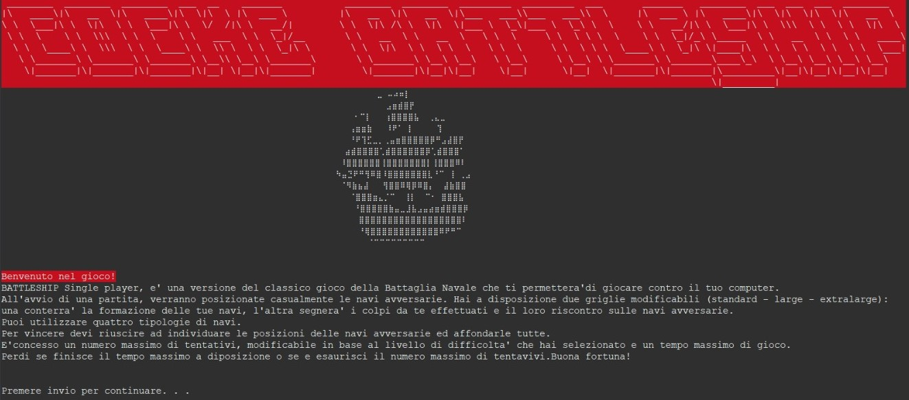

Per interagire con l'applicazione, il giocatore deve utilizzare i seguenti comandi: 

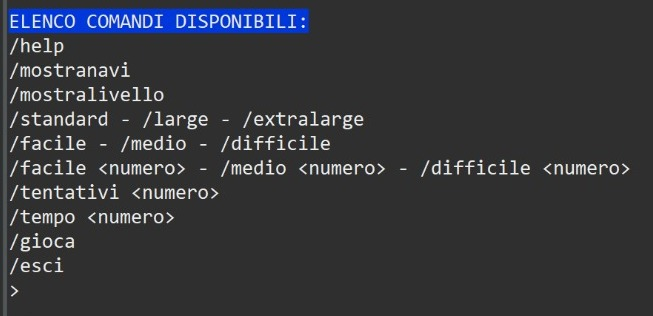

+ **“help”**: permette di accedere ad una descrizione concisa della lista di comandi disponibili, che normalmente appare all'avvio del programma, come di seguito riportato: 

    + Gioca
    + Esci
    + 	…

  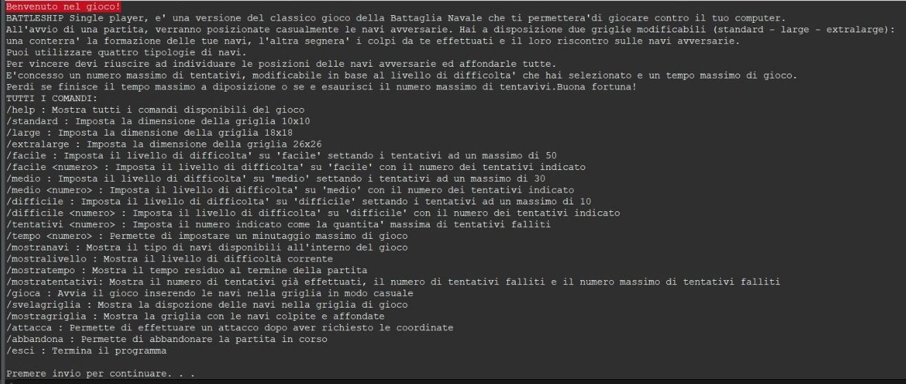

+ **“esci”**: permette di uscire dalla partita, dopo aver dato conferma;

  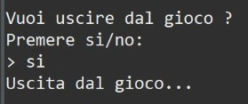

+ **“facile”**: permette di impostare il livello di gioco cambiando il numero massimo di tentativi falliti in 50;     

  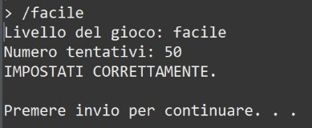

+ **“medio”**: permette di impostare il livello di gioco cambiando il numero massimo di tentativi falliti in 30;

  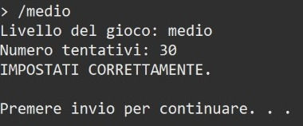

+ **"difficile”**: permette di impostare il livello di gioco cambiando il numero massimo di tentativi falliti in 10;

  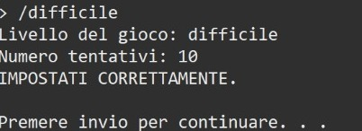

+ **"facile _numero_"**: permette di inserire ed cambiare l'impostazione di default del numero massimo di tentativi falliti per il livello facile;

  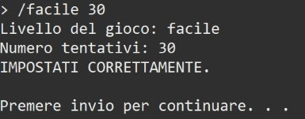

+ **"medio _numero_"**: permette di inserire ed cambiare l'impostazione di default del numero massimo di tentativi falliti per il livello medio;

  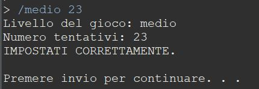

+ **"difficile _numero_"**: permette di inserire ed cambiare l'impostazione di default del numero massimo di tentativi falliti per il livello difficile;

  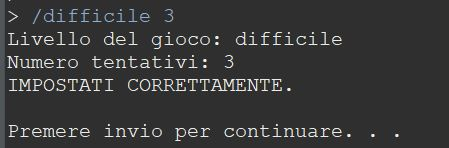

+ **“mostralivello”**: mostra mostrare il livello di gioco e il numero massimo di tentativi falliti;

  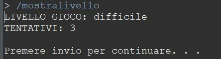

+ **“mostranavi”**: mostra i tipi di nave, di dimensione corrispondente ai quadratini visualizzati, e il numero di esemplari da affondare (in tutto sono 10), come di seguito riportato;

    +	**Cacciatorpediniere** 	⊠⊠ 		     esemplari: 4
    +   **Incrociatore** 		⊠⊠⊠ 		esemplari: 3  
    +   **Corazzata** 		    ⊠⊠⊠⊠ 	   esemplari: 2 
    +   **Portaerei** 		    ⊠⊠⊠⊠⊠ 	  esemplari: 1 

 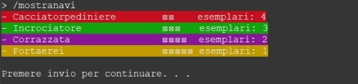

+ **“gioca”**: permette di avviare una partita. Se nessuna partita è in corso l'applicazione imposta causalmente le navi avversarie, in orizzontale o in verticale, mostra la griglia vuota e si predispone a ricevere il primo tentativo o altri comandi.

    La griglia visualizzata è di dimensione 10x10, con le righe numerate da 1 a 10 e le colonne da A a J, e presenta tutte le navi posizionate;

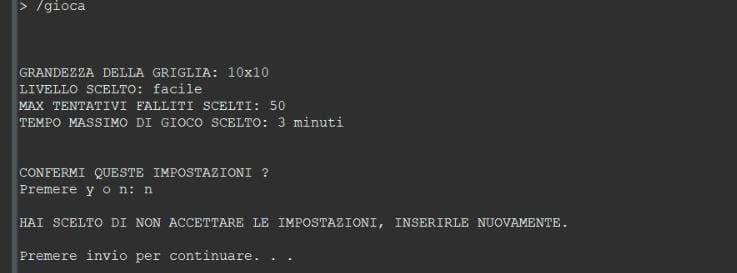

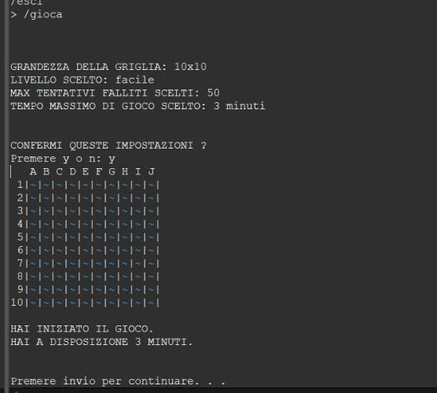

+ **"attacca"**: permette di effettuare un colpo, inserendo una coppia di caratteri, corrispondenti alle coordinate della cella che si vuole attaccare. 
I caratteri da inserire, lettera e numero (rispettivamente riga e colonna) devono essere separati da un trattino. 
Il comado permette di visualizzare l'esito del colpo:
    + _acqua_: nel caso in cui sulla cella colpita non vi sono navi;
    + _colpito_: nel caso in cui sulla cella vi è una nave; 
    + _colpito e affondato_: nel caso in cui la cella colpita corrisponde all'ultima cella componente una nave.

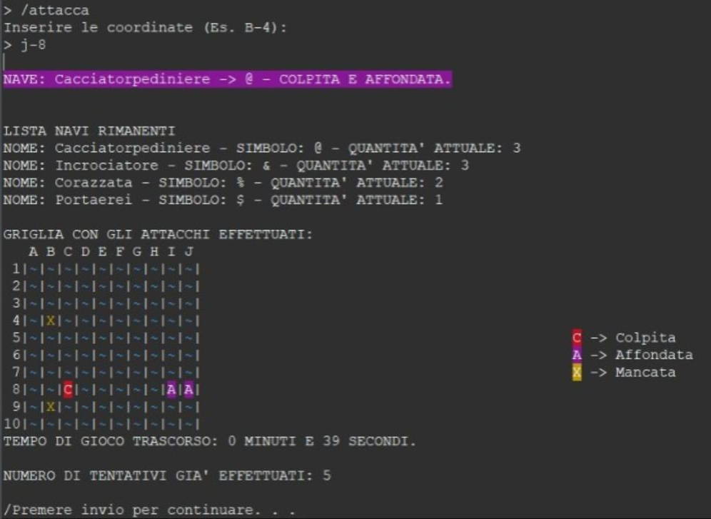

+ **“svelagriglia”**: permette mostrare la griglia con le navi posizionate e la relativa legenda.

  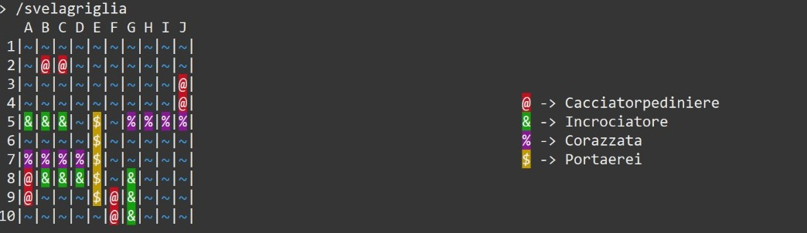

+ **"tentativi _numero_"**: permette di inserire ed impostare il numero di tentativi massimi.

  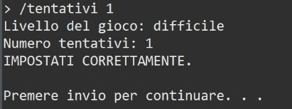

+ **"standard"**: permette di impostare la griglia alla dimensione di default (10x10). 

  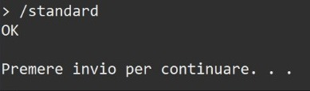

+ **"large"**: permette di impostare a 18x18 la dimensione della griglia.

  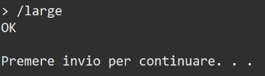

+ **"extralarge"**: permette di impostare a 26x26 la dimensione della griglia.

  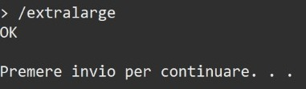

+ **"tempo _numero_"**: permette di inserire ed impostare il numero di minuti a disposizione per giocare una partita.

  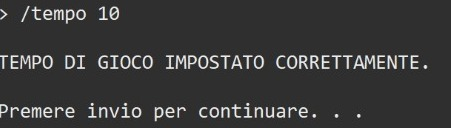

+ **"mostratempo"**: permette di visualizzare il numero di minuti trascorsi dall'inizio della partita e quelli ancora disponibili.

  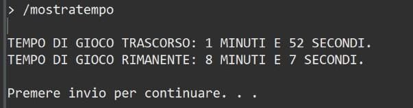

+ **"mostragriglia"**: permette di visualizzare la griglia, le cui righe sono numerate a partire da 1, le colonne a partire da A, insieme alle navi affontate (navi di cui sono state colpite tutte le parti che la compongno) e le navi colpite (navi di cui non sono state colpite tutte le parti che la compongono) e i colpi mancati .

  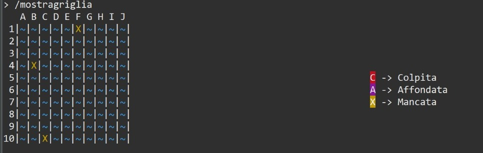

+ **"mostratentativi"**: permette di visualizzare il numero di tentativi già effettuati, il numero di tentativi falliti e il numero massimo di tentativi falliti ancora disponibili.

  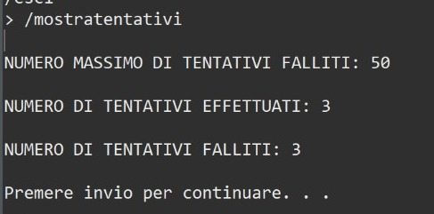

+ **"abbandona"**: permette di abbandonare il gioco 

  + In caso di conferma positiva (inserito Y) consente di visualizzare la griglia con la posizione di tutte le navi, e di inserire nuovi comandi. 

    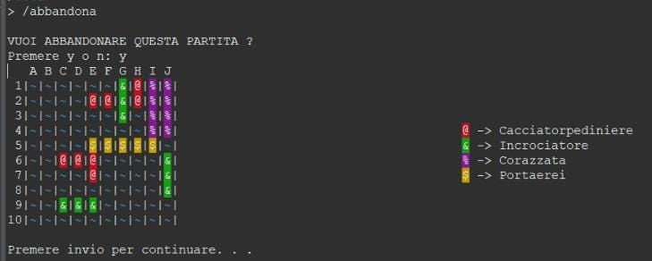

  + In caso di conferma negativa (inserito N) permette di inserire nuovi comandi o effettuare nuovi tenativi. 

    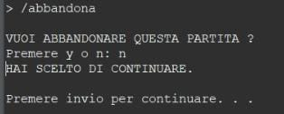

#### [8.Processo di sviluppo e organizzazione del lavoro](#processo-di-sviluppo-e-organizzazione-del-lavoro)

## **PROCESSO DI SVILUPPO E ORGANIZZAZIONE DEL LAVORO**

Il lavoro è stato diviso in una serie di iterazioni dette **Sprint**, in particolare è stato scisso in tre Sprint: **SPRINT 0, SPRINT 1 e SPRINT 2**.

Al lancio di ogni Sprint sono stati assegnati dei requisiti da analizzare, progettare, realizzare e testare.

Abbiamo realizzato sul portale GitHub una Product Roadmap con una lista di tutti i requisiti da implementare per il progetto che sono stati spostati ad ogni sprint in una Sprint backlog. Successivamente essi sono stati inseriti in una project board suddivisa in fasi: **TO DO, IN PROGRESS, REVIEW, READY e DONE**, che veniva aggiornata volta per volta per segnalare i progressi dell’implementazione dei requisiti richiesti.

**_SPRINT 0_**
L’_**obiettivo**_ dello _**Sprint 0**_ è stato quello di dimostrare famigliarità con _Git, GitHub Flow_ e il processo agile.
E’ stato creato un milestone, che è un indicatore che denota un cambiamento o una fase di sviluppo, nel quale è stata stabilita una data di inizio e una di fine. Durante lo svolgimento del progetto, sono state create le issue relative a tale Sprint, ed il lavoro è stato diviso tra i componenti del gruppo. Ogni issue presa in carico è stata risolta seguendo il GitHub Flow e ogni Pull Request è stata chiusa solo dopo aver effettuato la review con esplicita approvazione di almeno un componente del nostro gruppo.
Ogni issue ha una label, che definisce la tipologia. Ogni modifica avvenuta sulla repository è stata registrata con un _commit_, tramite una descrizione breve ma significativa.
Gli issue devono muoversi sulla project board per fermarsi sullo stato _Ready_ (lo stato _Done_ sarà usato solo dopo il feedback del docente).
Al termine dello svolgimento del primo sprint, l’esito è stato comunicato sul canale #consegne con il messaggio _"Cocke: Sprint 0 completato”_.

**_SPRINT 1_**
L’**_obiettivo_** dello **_Sprint_** 1 è stato preparare il gioco.
I requisiti richiesti, denominati come **user story** sono:
+ mostrare l'help con elenco comandi
+ chiudere il gioco 
+ impostare il livello di gioco per variare il numero massimo di tentativi falliti 
+ mostrare il livello di gioco e il numero massimo di tentativi falliti 
+ mostrare i tipi di nave e il numero 
+ iniziare una nuova partita 
+ svelare la griglia con le navi posizionate
  
E’ stato abbozzata la relazione tecnica tramite utilizzo di un file Markdown denominato Report.md con le seguenti sezioni:
+ **1. Introduzione**
+ **2. Modello di dominio** 
+ **3. Requisiti specifici**
    + 3.1 Requisiti funzionali 
    + 3.2 Requisiti non funzionali
+ **7. Manuale utente**
+ **9. Analisi retrospettiva**
    + 9.1 Sprint 0 (con screenshot di una lavagna strutturata secondo il modello Retrospettiva/"Arrabbiato, triste, felice")

I vari requisiti richiesti nello Sprint 1, che nella project board si trovavano inizialmente in _TO DO_, sono stati suddivisi tra i vari componenti del gruppo, passati in _PROGRESS_, implementati e dopo di che passati in _REVIEW_ in modo che la Pull Request avesse l’approvazione di un altro componente del gruppo e infine in _DONE_.

Il Milestone dello sprint0 è stato chiuso.
Sono stati risolti i problemi segnalati da _CheckStyle_ e risolti i problemi segnalati da _Spotbugs_.
La procedura delle issues è stata la stessa dello sprint precedente.

**_SPRINT 2_**
L’**_obiettivo_** dello **_Sprint 2_**, invece, è stato completare il gioco, assicurando la qualità del lavoro svolto.
I requisiti richiesti sono, denominati come **user story**:
+ Impostare il numero massimo di tentativi falliti per livello di gioco
+ Impostare direttamente il numero massimo di tentativi che si possono fallire
+ Impostare la taglia della griglia
+ Impostare il tempo di gioco
+ Mostrare il tempo di gioco
+ Effettuare un tentativo per colpire una nave
+ Mostrare la griglia con le navi colpite e affondate 
+ Mostrare il numero di tentativi già effettuati e il numero massimo di tentativi falliti
+ Abbandonare una partita

Anche per questo Sprint sono state divise le issue tra i componenti del gruppo e abbiamo proceduto nello stesso modo dello Sprint 1. 

L’obiettivo dell’ultimo Sprint è stato _“Comunicare la qualità del lavoro svolto”_ per questo ci siamo occupati di correggere gli errori di implementazione degli Sprint precedenti, in particolare il modello di dominio e qualche imprecisione sulla documentazione.

Inoltre, abbiamo completato il file _Report.md_ che tratta la relazione tecnica, in particolare le sezioni:

+ **4. System Design** (opzionale: stile architetturale adottato; diagramma dei package, diagramma dei componenti; commentare le decisioni prese con riferimento ai requisiti non funzionali)

+ **5. OO Design** (diagrammi delle classi e diagrammi di sequenza per le user story considerate più importanti; commentare le decisioni prese con riferimento ai principi di OO design; menzionare l'eventuale applicazione di design pattern)
+ **6. Riepilogo del test** (sintesi con informazioni sul criterio di selezione, localizzazione e numero dei casi di test)

+ **8. Processo di sviluppo e organizzazione del lavoro**

+ **9.2 Sprint 1**(con screenshot di una lavagna strutturata secondo il modello Retrospettiva/"Arrabbiato, triste, felice").

Inoltre ogni classe è stata fornita di un commento Javadoc che specifica il tipo **ECB**(`<<Entity>>`, `<<Control>>`, `<<Boundary>>`), se applicabile, e riassume la responsabilità della classe.
Sono stati applicati i principi di _OO design_ e sono stati creati i casi di test automatici.
Ci siamo occupati anche di correggere gli errori segnalati dai plugin _Checkstyle e Spotbugs_ nel codice dell'applicazione. Sono stati creati i casi di test di tipo JUnit per verificare il corretto funzionamento del programma e, infine, è stato riportato tutto nella relazione tecnica finale.

Il nostro gruppo è riuscito ad organizzarsi in modo efficiente stato molto organizzato, insieme abbiamo deciso di chiamarci tramite il portale di Microsoft Teams a giorni alterni, per avere il giusto tempo per svolgere a piccoli passi il lavoro assegnato ad ognuno e poter mostrare i progressi agli altri componenti del gruppo. Per ogni sprint ci siamo divisi il lavoro da svolgere, ma abbiamo sempre interagito tra di noi per aiutarci e confrontarci.

#### [9.Analisi Retrospettiva](#analisi-retrospettiva)

#### ANALISI RETROSPETTIVA
+ #### [9.1 SPRINT 0](#sprint-0)
#####    *9.1* *SPRINT 0*
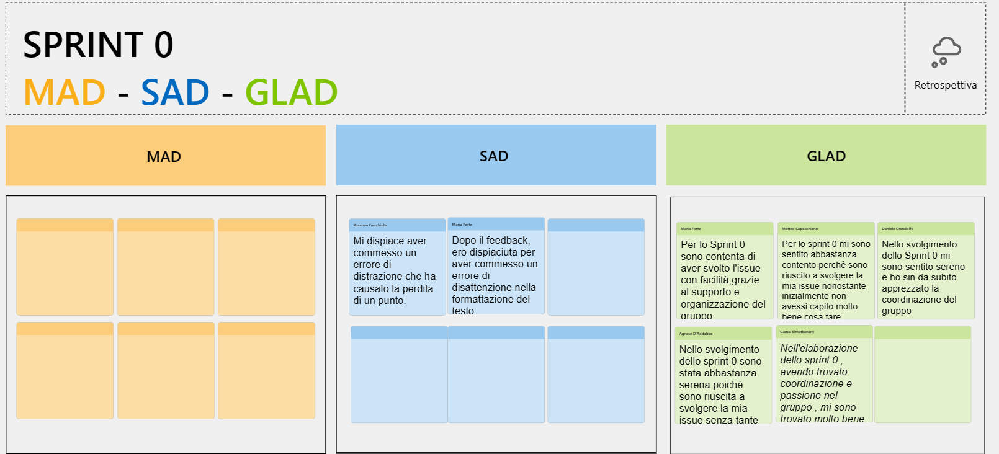

+ #### [9.2 SPRINT 1](#sprint-1)
#####    *9.2* *SPRINT 1*
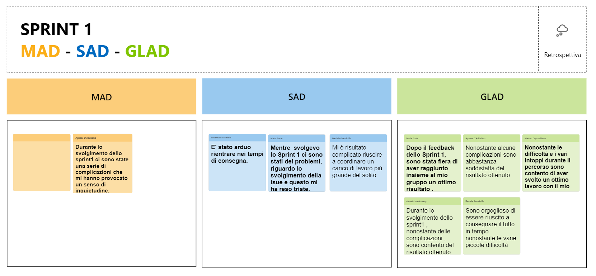

